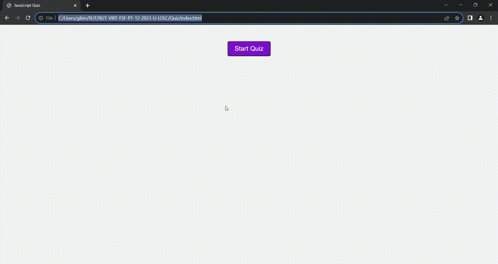

# Quiz

This web application is a timed quiz based on JavaScript fundamentals that stores high scores

When the start button is clicked, then a timer starts and presented with a question and answering that question another question is displayed
When a question is answered incorrectly, then time is subtracted from the clock by 10 seconds.
When all questions are answered or the timer reaches 0, Then the game is over
When the game is over, then user can save initials and score

JavaScript and CSS file is properly commented.

* The URL of the deployed application - https://gibinmgeorge.github.io/Password_Generator/

* The URL of the GitHub repository - https://github.com/GibinMGeorge/Quiz

screenshots - 

